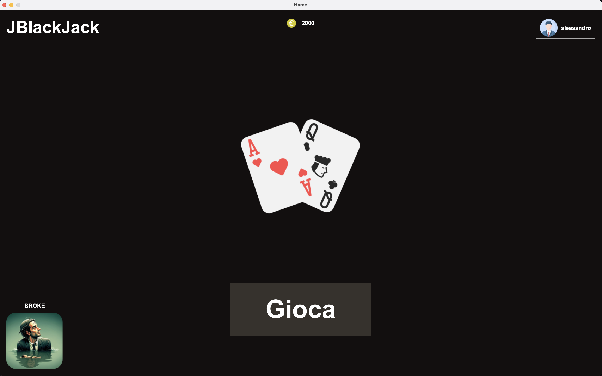
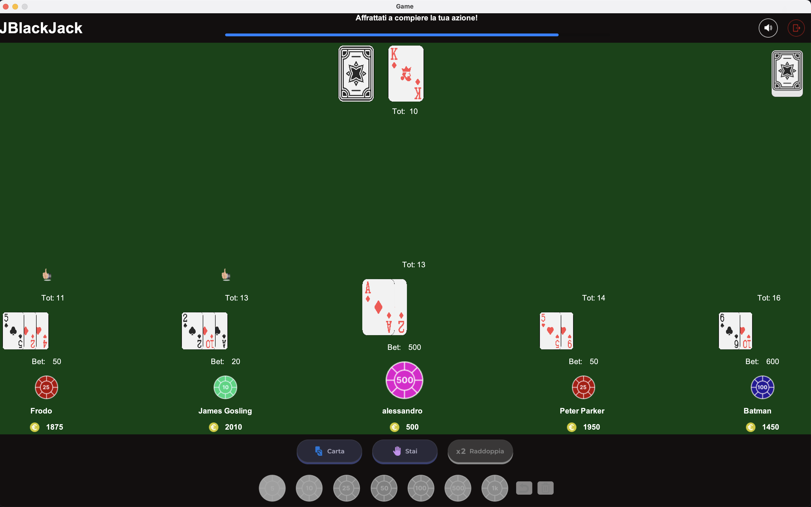

# JBlackJack

<table style="width:100%; table-layout:fixed; border-collapse:collapse;">
  <tr>
    <td style="width:100%; padding:0;">
      
    </td>
  </tr>
  <tr>
    <td style="width:100%; padding:0;">
      
    </td>
  </tr>
</table>

## How to play

### IntelliJ

1. Clone the repo
2. Run the JBlackJack.java file inside the src directory

### Eclipse

1. Clone the repo
2. Create a Project in eclipse
3. Inside the created project, import the repo
4. Run the BlackJack.java file inside the default package
